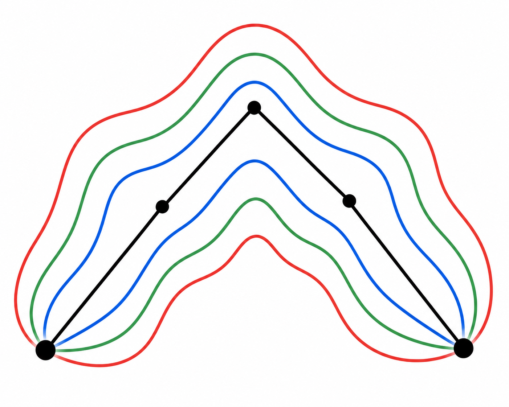

<p align="center"></p>

# PolyDet

**Renormalised one-loop fluctuation determinant around a polygonal bounce** (false-vacuum decay) — a Wolfram Language paclet and companion to [FindBounce](https://github.com/vguada/FindBounce). It *consumes* a polygonal bounce (segment masses + matching radii) and returns `ln det_ren` via the transfer-matrix multipole sum with optimal-truncation acceleration and MS-bar renormalisation (`D = 3, 4`). It is the next factor after FindBounce's action,
`Gamma ~ (...) (det S'')^{-1/2} e^{-S}`.

Sectors: **single scalar**, **coupled multi-scalar** (mass matrices, zero-mode removal, nucleation-rate assembly), **Dirac fermion** (Yukawa), and **Abelian gauge boson** (`U(1)` Higgs, ghost collapse).

The paclet source lives in [`PolyDet/`](PolyDet); [`Build.wls`](Build.wls) packs it into a distributable `.paclet` archive.

## Install

Download the built `PolyDet-<version>.paclet` from the [latest release](https://github.com/nemevsek/PolyDet/releases/latest) — it bundles the indexed Documentation Center pages (guide, reference pages, tutorials) — then:

```mathematica
PacletInstall["/path/to/PolyDet-0.4.0.paclet", ForceVersionInstall -> True]
Needs["PolyDet`"]
```

Then **restart the front end** (or quit and relaunch Mathematica) so the Documentation
Center rebuilds its list of installed paclets — the `PolyDet` guide and `?PolyDet*` `>>`
links appear after the restart.

For development from a source checkout — gives the **kernel** functions but **not** the
Documentation Center pages (the source tree has no search index; that is generated only
by the `.paclet` build):

```mathematica
PacletDirectoryLoad["/path/to/PolyDet-checkout"];  (* the repo root, containing PolyDet/ *)
Needs["PolyDet`"]
```

## Quick start

```mathematica
(* per-multipole Gel'fand-Yaglom log-ratio *)
PolyDetLnR[3, {1., 2., 1.5}, {2., 3.}]

(* renormalised determinant on a thin-wall polygon (segment masses^2, radii) *)
PolyDetRen[masses2, radii, "Dimension" -> 4]

(* straight from a FindBounce BounceFunction bf *)
{masses2, radii} = PolyDetInputs[Vpp, bf];
PolyDetRen[masses2, radii]
```

See the **PolyDet** guide page (Documentation Center, search "PolyDet") for the full
symbol list across all four sectors, and the reference pages for the main entry points
`PolyDetRen`, `PolyDetSigma`, `PolyDetLnR`, `PolyDetInputs`, `PolyDetRenMat`,
`PolyDetRenPsi`, `PolyDetSigmaGauge`, `PolyDetRate`.

## Build from source

```bash
wolframscript -file Build.wls            # build docs + pack PolyDet-<ver>.paclet
wolframscript -file PolyDet/Tests/run.wls  # run the test suite
```

## License

Released under the [MIT License](LICENSE).

## Author

Miha Nemevšek — `miha.nemevsek@ijs.si`
